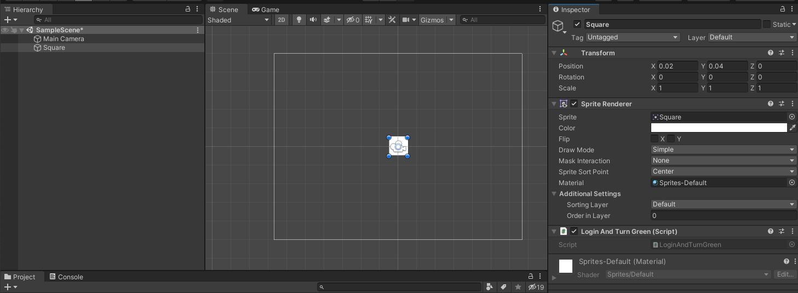

Integrating with Unity
=============
Integrating MEDKit with an existing or new Unity project can be done by opening the unity package manager (Window > Package Manager in the
top menu), and using "Install from Git" with the following URL ({{ INSERT MISSING INFO HERE }}).

This installs the C# MEDKit SDK for use with your game. This document assumes some familiarity with C#, and will be starting from the unity
2D starter project.

Websockets
===========

## Step 0: Creating an extension on the developer portal and registring it with Muxy
{{ This should be covered somewhere, link the expected steps here. }}


## Step 1: Making a square that turns green on login.
First, create a square sprite and place it into the viewing frustrum. Attach a new behavior to this script, named "LoginAndTurnGreen":



Now, edit the newly created script to use MuxyGameLink:

```C#
using MuxyGameLink;
```

Add a SDK member and modify the `Start()` method to initialize the SDK:
```C#
	private SDK medkit;
    void Start()
    {
        medkit = new SDK("myclientid");
    }
```

## Step 1.5: Creating the websocket transport
To connect to the Muxy GameLink servers, a websocket transport must be created. In this document, we'll be using NativeWebsockets,
which can be installed by using the package manager, and using "Install from Git" with the url `https://github.com/endel/NativeWebSocket.git#upm`.

After installing NativeWebsockets, create a websocket member and create a ConnectWebsocket() method, and a SendWebsocketMessage method to send websocket messages continuously.

```C#
	private Websocket socket; 
	private void ConnectWebsocket() 
	{
		// Generate the connection URL based on the stage you want to connect to.
		String websocketAddress = "ws://" + Gamelink.ConnectionAddress(Stage.Production);
		socket = new Websocket(websocketAddress);

		// Hookup the message handler.
		socket.OnMessage += (bytes) => 
		{
			// Convert into a string that can be passed into gamelink.
			String message = System.Text.Encoding.UTF8.GetString(bytes);
			medkit.ReceiveMessage(message);
		};

		// Invoke the sending method every half second
		InvokeRepeating("SendWebsocketMessage", 0.0f, 0.5f);
	}

	private void SendWebSocketMessage()
    {
		// Only send if the websocket is still open.
        if (socket.State == WebSocketState.Open)
        {
			// And send every payload, every time.
            medkit.ForEachPayload((string payload) =>
            {
                socket.SendText(payload);
            });
        }
    }
```

After setting up the websocket, make sure you connect in Start():

```C#
    void Start()
    {
        medkit = new SDK("myclientid");
		ConnectWebsocket();
    }
```

### Step 2: Invoking authentication
To authenticate a user, use the SDK method AuthenticateWithPIN, with a user provided
PIN. Generally, this would involve creating a UI for the user to input their PIN, which is out of scope of this document.

```C#
	void Authenticate(string PIN)
	{
		medkit.AuthenticateWithPIN(PIN, (AuthenticationResponse payload) => 
		{
			// Check errors
			Error err = payload.GetFirstError();
			if (err != null)
			{
				// Authentication failed, don't turn green.
				return;
			}

			// Turn green.
			GetComponent<SpriteRenderer>().color = new Color(0, 1, 0, 1);
		});
	}	
```

### Step 3: Saving the refresh token after authorization
After authenticating with a PIN, the response will have a refresh token that should be stored:

```C# 
	// Obtaining the refresh token. The implementation of SaveRefreshToken is omitted.
	medkit.AuthenticateWithPIN(PIN, (AuthenticationResponse payload) => 
	{
		// ...
		if (medkit.IsAuthenticated())
		{
			string refreshToken = medkit.User?.RefreshToken;
			if (!String.IsNullOrEmpty(refreshToken))
			{
				SaveRefreshToken(refreshToken);
			}
		}
	});
```

After storing the refresh token, it can be used to authenticate the user without having to go through PIN based
authentication:

```C#
	// Using the refresh token. The implementation of LoadRefreshToken is omitted.
	string refreshToken = LoadRefreshToken();
	if (String.IsNullOrEmpty(refreshToken))
	{
		DoAuthWithPIN();
	}
	else
	{
		medkit.AuthenticateWithRefreshToken(refreshToken, (AuthenticationResponse payload) => 
		{
			// Note that you have the same authentication response here, complete with refresh token.
			// Refresh tokens may change on use, so save the refresh token after every successful auth.
		});
	}
```
